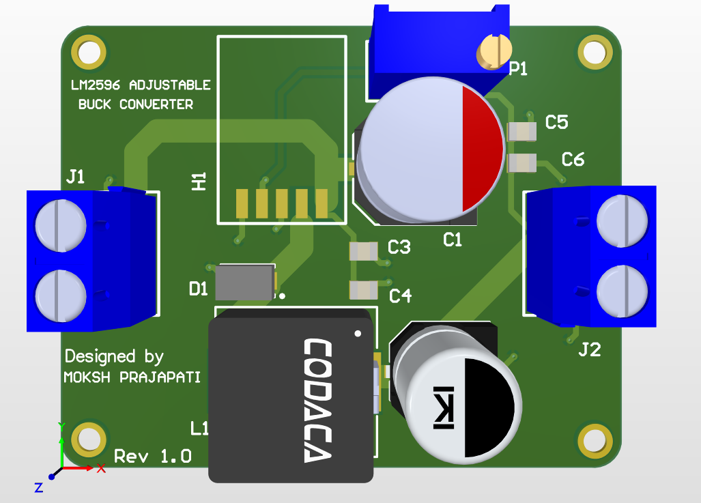
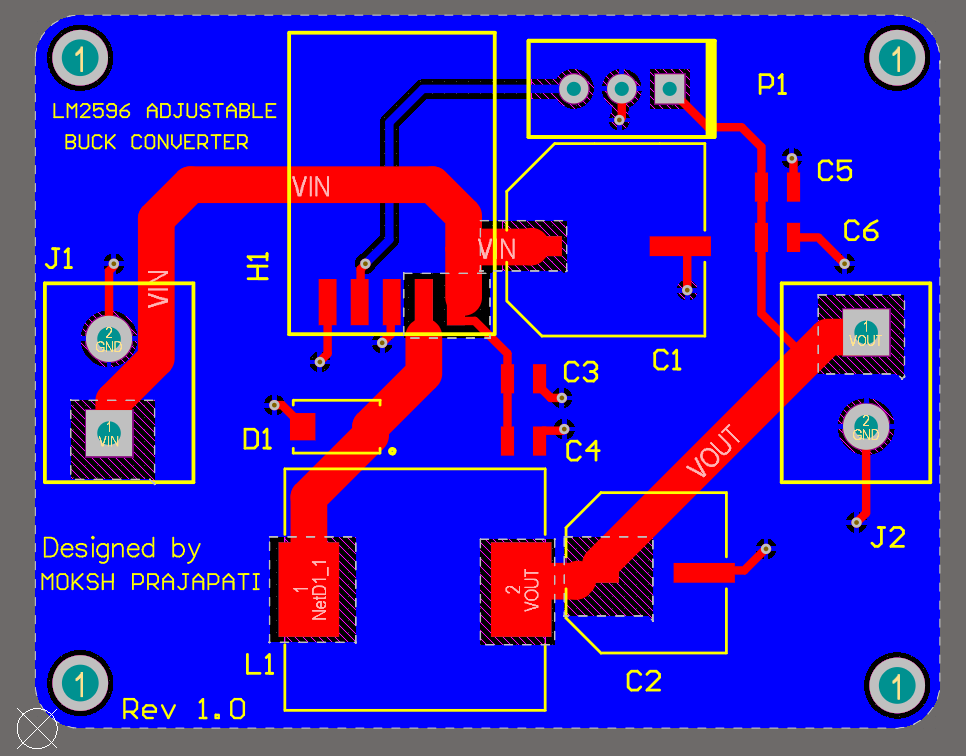
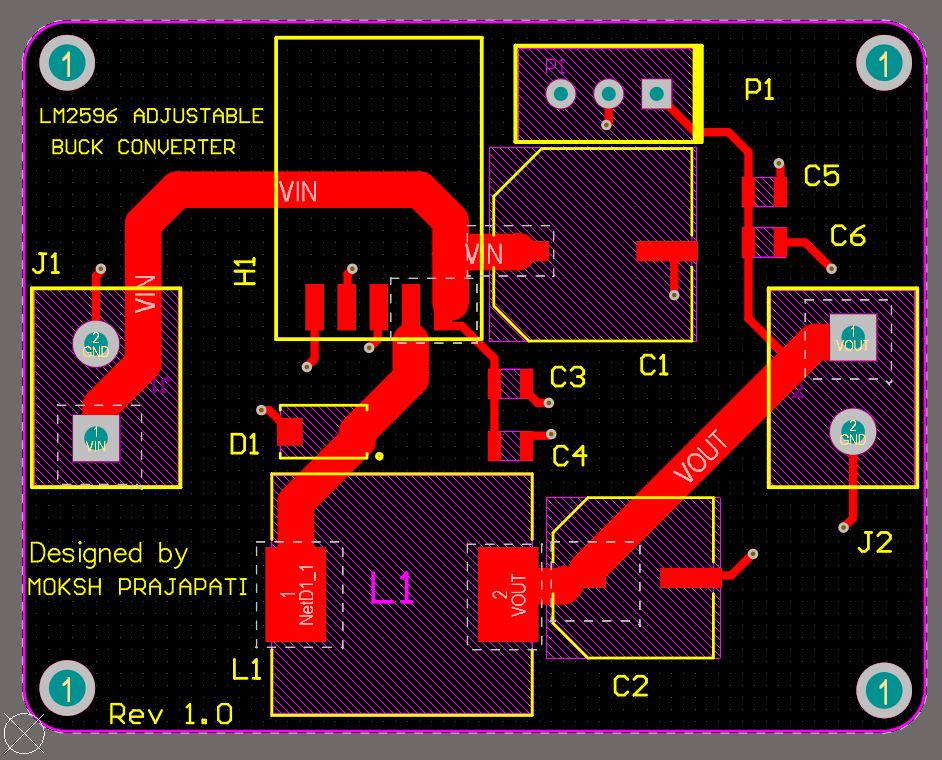
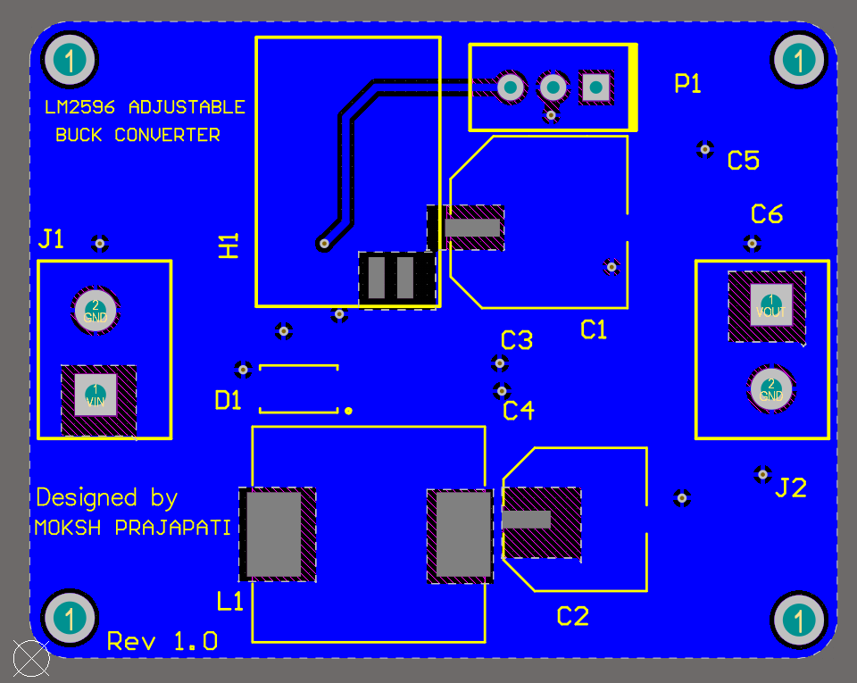
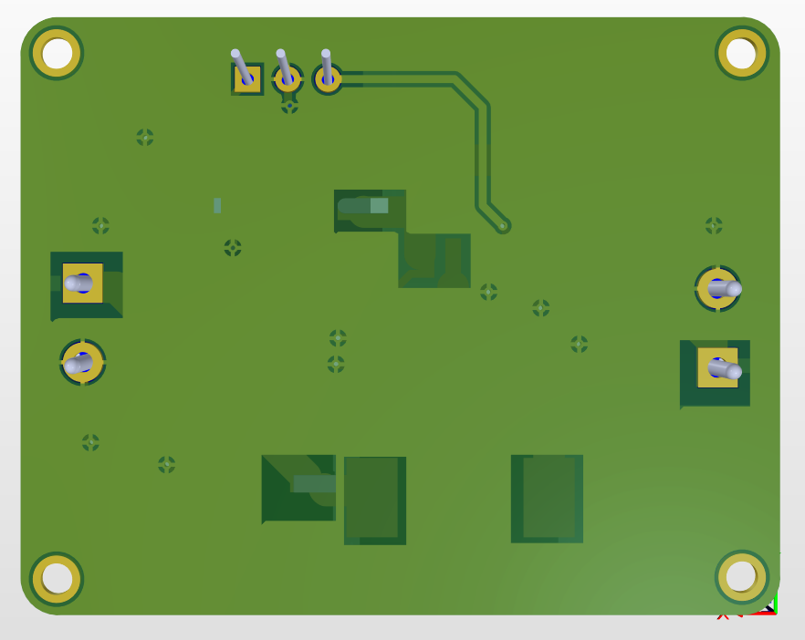

# LM2596 Adjustable Buck Converter PCB Design

A professionally designed 2-layer LM2596 Adjustable Buck Converter PCB developed in Altium Designer 25.1. This project includes custom schematic symbol creation, custom PCB footprint development, ERC/DRC verification, BOM generation, Gerber generation, and manufacturing-ready outputs.

---

# Project Overview

The objective of this project was to design a compact, reliable, and manufacturable DC-DC buck converter PCB based on the LM2596 Adjustable Switching Regulator.

The schematic was designed by studying the LM2596 datasheet and application guidelines, followed by PCB implementation, verification, and manufacturing preparation in Altium Designer 25.1.

Unlike linear regulators, switching regulators provide significantly higher efficiency by minimizing power dissipation and heat generation during voltage conversion.

---

# Project Specifications

| Parameter | Specification |
|------------|--------------|
| PCB Type | DC-DC Buck Converter |
| PCB Layers | 2-Layer PCB |
| Design Software | Altium Designer 25.1 |
| Main IC | LM2596 Adjustable |
| Inductor | 47 µH |
| Diode | SS54 Schottky Diode |
| Ground Plane | Bottom Layer GND Pour |
| Verification | ERC Passed, DRC Passed |
| BOM Generation | Completed |
| Gerber Generation | Completed |
| Manufacturing Outputs | Generated |
| Custom Symbol | Yes |
| Custom Footprints | Yes |
| 3D Verification | Completed |

---

# Key Features

- Adjustable Output Voltage Regulation
- High-Efficiency Switching Converter Design
- 2-Layer PCB Layout
- Custom Schematic Symbols
- Custom PCB Footprints
- Wide High-Current Power Routing
- Bottom Layer Ground Plane
- ERC Verification
- DRC Verification
- BOM Generation
- Gerber Generation
- Manufacturing Documentation
- 3D PCB Verification

---

# Project Images

## Schematic Diagram

---

## Final PCB Layout

---

## Top Layer

---

## Bottom Layer

---

## 3D Top View

---

## 3D Bottom View

---

# Main Components

| Designator | Component | Function |
|------------|-----------|----------|
| U1 | LM2596 Adjustable Regulator | Main Switching Regulator |
| D1 | SS54 Schottky Diode | Freewheeling Diode |
| L1 | 47 µH Inductor | Energy Storage Element |
| RV1 | 10 kΩ Potentiometer | Output Voltage Adjustment |
| C1 | 100 µF Capacitor | Input Filtering |
| C2 | 220 µF Capacitor | Output Filtering |
| C3, C5 | 100 nF Capacitors | High-Frequency Noise Filtering |
| C4, C6 | 1 µF Capacitors | Additional Filtering |
| J1 | Input Terminal Block | DC Input Connection |
| J2 | Output Terminal Block | Regulated Output Connection |

---

# Working Principle

The LM2596 operates as a switching regulator that efficiently converts a higher DC voltage into a lower regulated DC voltage.

### Power Flow

1. Input power enters through the input terminal block.
2. Input capacitors filter noise and ripple.
3. LM2596 switches the input voltage at high frequency.
4. The inductor stores and transfers energy.
5. The Schottky diode provides the current path during switching OFF periods.
6. Output capacitors smooth the output voltage.
7. The feedback network regulates the output voltage through duty-cycle control.

This topology provides significantly better efficiency compared to traditional linear regulators.

---

# PCB Design Highlights

## Component Placement Strategy

Components were arranged according to functional power flow:

**Input Connector → Input Filter → LM2596 → Inductor & Diode → Output Filter → Output Connector**

Benefits:

- Improved routing efficiency
- Better current flow management
- Easier manufacturability
- Cleaner PCB organization

---

## Routing Considerations

Special attention was given to:

- Wide power traces
- Short high-current paths
- Reduced voltage drop
- Reduced resistive losses
- Improved current carrying capability

High-current routing was implemented for:

- VIN
- Switching Node
- VOUT

---

## Grounding Strategy

A bottom-layer GND copper pour was implemented to provide:

- Lower ground impedance
- Better return current paths
- Improved PCB reliability
- Enhanced manufacturability

---

# Design Verification

## Electrical Rule Check (ERC)

- ERC Completed Successfully
- No critical schematic connectivity issues detected

## Design Rule Check (DRC)

Final DRC Results:

- Clearance Violations = 0
- Width Violations = 0
- Unrouted Nets = 0
- Total DRC Errors = 0

The PCB successfully passed all verification checks before manufacturing output generation.

---

# Project Outcome

### Accomplishments

- Designed schematic from LM2596 datasheet reference circuit
- Created custom schematic symbols
- Created custom PCB footprints
- Completed PCB layout implementation
- Performed ERC verification
- Performed DRC verification
- Generated BOM
- Generated Gerber files
- Generated manufacturing outputs
- Completed 3D PCB verification

The final design is manufacturing-ready and suitable for educational, embedded, and power electronics applications.

---

# Repository Structure

## Design Files

- PCB Layout (.PcbDoc)
- Schematic (.SchDoc)
- Altium Project (.PrjPcb)

## Libraries

- Custom Schematic Library (.SchLib)
- Custom PCB Library (.PcbLib)

## Reports

- ERC Report
- DRC Report

## Manufacturing Files

- Gerber Files
- NC Drill Files
- Manufacturing Outputs

## Documentation

- BOM
- PCB Layout Images
- 3D PCB Images

---

# Skills Demonstrated

- PCB Design & Layout
- Altium Designer 25.1
- Power Electronics PCB Design
- Custom Symbol Development
- Custom Footprint Development
- Datasheet Interpretation
- Component Placement Optimization
- High-Current Routing
- Ground Plane Design
- ERC Verification
- DRC Verification
- BOM Generation
- Gerber Generation
- Manufacturing Documentation

---

# Software Used

- Altium Designer 25.1

---

# Author

**Moksh Prajapati**

Electronics Engineering Student
PCB Design Enthusiast

Focused on:
• PCB Design
• Power Electronics
• ESP32 Hardware Design
• Altium Designer
• KiCad

GitHub: https://github.com/moksh-pcb-design

---

⭐ If you found this project useful, consider giving it a star.
